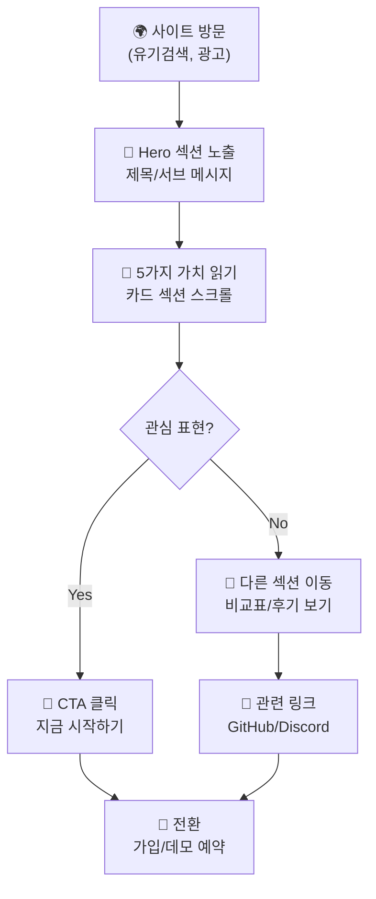
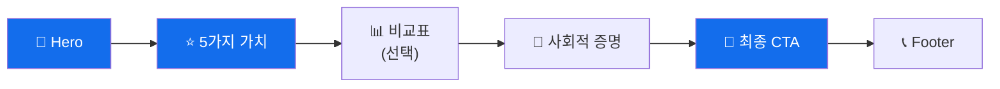

# 03. 플로우 & UX: Onestack 홍보 웹페이지

상태: `EXECUTION_READY`

작성일: 2026-04-17

## 1) 핵심 플로우 (v1)

### 방문자 여정 (Customer Journey)



### 섹션 간 네비게이션 플로우



## 2) UX 노트

### 주요 여정
1. **신속한 가치 이해**: 방문자가 처음 3초 안에 "Code to Edge, Securely"의 의미를 이해
2. **순차적 공감**: 5가지 가치를 한 번에 하나씩 읽으면서 공감대 형성
3. **명확한 다음 단계**: CTA 버튼이 명백하고, 클릭 유도가 자연스러움
4. **모바일 최우선**: 모바일에서도 큰 CTA, 빠른 로딩 보장

### 예외/실패 케이스
- **느린 로딩**: Lighthouse < 90 점 → 성능 개선 필요
- **CTA 클릭 어려움**: 모바일에서 버튼이 너무 작거나 숨김 → 반응형 재검토
- **정보 과다**: 한 섹션에 너무 많은 텍스트 → 핵심만 3줄 이내로 제한
- **비직관적 네비게이션**: 사용자가 어디있는지 모름 → 진행 지시자 필요

### 역할별 차이
- **개발자**: 빠른 스캔 선호 → 불릿 포인트, 짧은 문장 사용
- **CTO/의사결정자**: 상세 정보 필요 → "더 알아보기" 링크 제공
- **신규 방문자**: 처음 경험 → 헤더 메뉴 간단하게 유지

## 3) 페이지 목록 (요약)

### Onestack 홍보 웹페이지 구성 (단일 페이지 앱)

> **페이지 정의**: 단일 랜딩 페이지 (`/`)로 구성되며, 섹션 기반 스크롤 네비게이션을 사용합니다. 데모/가입은 외부 페이지로 이동합니다.

#### [방문자] 랜딩 페이지 (`/`)
- **핵심 작업**: 
  1. 헤더/네비게이션: 로고, 섹션 링크, CTA 미니 버튼
  2. Hero 섹션: 헤드라인, 서브 메시지, 메인 CTA
  3. 5가지 가치제안 카드 스크롤
  4. 사회적 증명 섹션
  5. 비교 테이블 (선택)
  6. 최종 CTA 섹션
  7. 푸터: 링크, 소셜, 법률 정보

- **상태**: `✅ DESIGN_READY`
  - 와이어프레임: 완료
  - 컴포넌트 명세: 하단 참고

## 4) 섹션별 컴포넌트 명세

### 4.1 헤더/네비게이션

**자연어 프롬프트**:
고정 헤더, 로고 및 섹션 링크(Features, Security, Performance, Pricing, Contact), 모바일 해버거 메뉴, 우측 CTA 버튼("시작하기").

**JSON 명세**:

```json
{
  "section": "Header",
  "components": ["Logo", "NavLinks", "MobileMenu", "CTAButton"],
  "states": ["sticky", "scrolled", "mobileOpen"],
  "actions": ["click:navLink", "click:hamburger", "click:CTA"]
}
```

### 4.2 Hero 섹션

**자연어 프롬프트**:
풀스크린 배경(코드/글로벌 지도 시각화), 헤드라인 "Code to Edge, Securely", 서브 메시지, 메인 CTA 버튼 2개 (지금 시작하기, 데모 보기), 아래로 스크롤 지시자.

**JSON 명세**:

```json
{
  "section": "Hero",
  "components": ["BackgroundImage", "Headline", "Subheadline", "PrimaryCTA", "SecondaryCTA", "ScrollIndicator"],
  "states": ["loading", "ready"],
  "actions": ["click:PrimaryCTA", "click:SecondaryCTA"]
}
```

### 4.3 5가지 가치제안 카드 섹션

**자연어 프롬프트**:
제목 "Onestack의 5가지 핵심 가치", 5개의 카드 그리드 (반응형 2x3 또는 1x5), 각 카드: 아이콘 + 제목 + 3줄 설명 + 선택 호버 효과.

**JSON 명세**:

```json
{
  "section": "ValuePropositions",
  "components": ["SectionTitle", "ValueCard[5]"],
  "states": ["default", "hover"],
  "actions": ["hover:expandDetails"],
  "dataStructure": {
    "title": "string",
    "icon": "SVG",
    "description": "string",
    "details": ["string"]
  }
}
```

### 4.4 사회적 증명 섹션

**자연어 프롬프트**:
제목 "X,XXX명 이상의 개발자가 신뢰합니다", 통계(고객 수, 배포 건수, 별점) 표시, 고객사 로고 5~8개 (그레이스케일, 호버 시 컬러), 사용자 후기 슬라이더 (2~3개).

**JSON 명세**:

```json
{
  "section": "SocialProof",
  "components": ["SectionTitle", "Stats", "ClientLogos", "TestimonialsSlider"],
  "states": ["loading", "ready"],
  "dataStructure": {
    "stats": ["customers", "deployments", "rating"],
    "testimonials": [{"name": "string", "role": "string", "quote": "string"}]
  }
}
```

### 4.5 기능 비교 테이블 (선택)

**자연어 프롬프트**:
제목 "왜 Onestack인가?", 테이블: 행(기능) × 열(Vercel, Heroku, Onestack), ✅/❌/⭐ 표시, 반응형 모바일 뷰 스택.

**JSON 명세**:

```json
{
  "section": "ComparisonTable",
  "components": ["SectionTitle", "Table"],
  "states": ["desktop", "mobile"],
  "dataStructure": {
    "features": ["string"],
    "competitors": [{"name": "string", "status": "check|cross|star"}]
  }
}
```

### 4.6 최종 CTA 섹션

**자연어 프롬프트**:
배경 색상(Primary #136dec), 큰 제목 "지금 배포 시작하기", 메인 CTA 버튼, 세부 CTA 링크(GitHub, Discord, 문서).

**JSON 명세**:

```json
{
  "section": "FinalCTA",
  "components": ["SectionTitle", "PrimaryCTA", "SecondaryLinks"],
  "states": ["default"],
  "actions": ["click:primaryCTA", "click:externalLink"]
}
```

### 4.7 푸터

**자연어 프롬프트**:
5개 칼럼: 회사 정보 (로고, 1줄 설명), 빠른 링크(Docs, API, Blog, Status), 커뮤니티(GitHub, Twitter, Discord), 법률(Privacy, Terms, Cookies), 저작권 및 언어 선택기.

**JSON 명세**:

```json
{
  "section": "Footer",
  "components": ["CompanyInfo", "Links", "SocialLinks", "Legal", "Copyright"],
  "states": ["default"],
  "actions": ["click:link", "click:socialIcon"]
}
```
