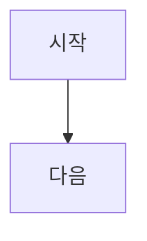
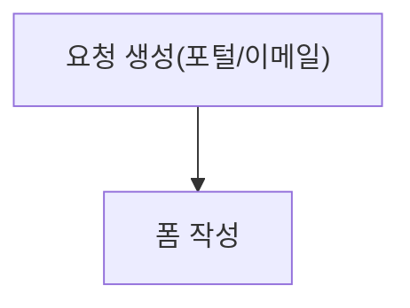
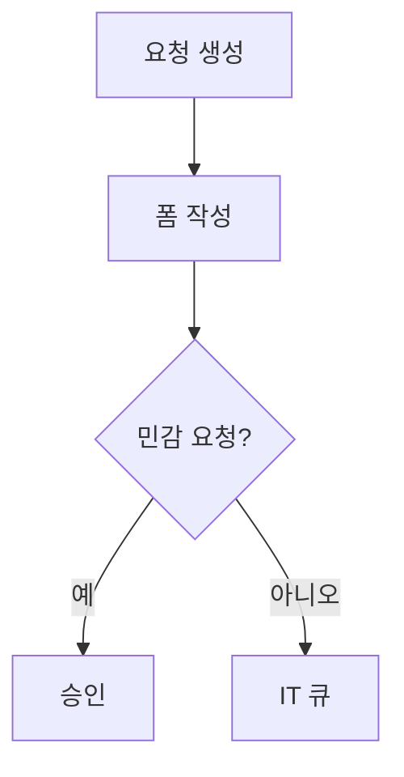

# Mermaid 작성 규칙 (Plana)

이 문서는 Plana에서 Mermaid 다이어그램을 작성할 때 **파싱 에러/렌더 실패를 줄이고**, 팀이 일관된 스타일로 문서를 작성하기 위한 규칙이다.

## 1) 기본 원칙

- Mermaid 블록은 항상 fenced code block으로 작성한다.
- 플로우차트는 `flowchart TD`를 기본으로 한다.

```md

```

## 2) 파싱 에러 방지 규칙(중요)

### 2.1 엣지(화살표)는 줄 끝에 두지 않는다

- ❌ (에러 유발) `A -->`
- ✅ `A --> B`

### 2.2 길어지면 “노드 정의”와 “연결”을 분리한다



### 2.3 라벨은 따옴표로 감싼다(권장)

괄호, 슬래시(`/`), 콜론(`:`), 중점(`·`) 등 특수문자가 포함될 수 있으므로 안전하게 따옴표를 권장한다.

- ✅ `A["Request created (portal/email)"]`

## 3) 한글 작성 규칙

### 3.1 노드 ID는 영문/숫자/언더스코어만 사용

- ✅ `REQ_CREATED`, `SENSITIVE_CHECK`, `approval_1`
- ❌ `요청생성`, `req created`

한글은 **노드 라벨**에만 사용한다.

### 3.2 라벨은 한글(필요 시 영문 병기)로 작성



## 4) 스타일(가독성)

- 라벨은 문장형보다는 **짧은 명사구**로 작성한다.
- 너무 길면 줄바꿈 대신 **단어를 줄여** 표현한다(줄바꿈은 렌더링 환경마다 깨질 수 있음).

## 5) 자주 발생하는 오류

- 화살표가 줄 끝에 있음: `A -->` (불가)
- 노드 ID에 공백/한글 사용: `요청 생성["..."]` (불가)
